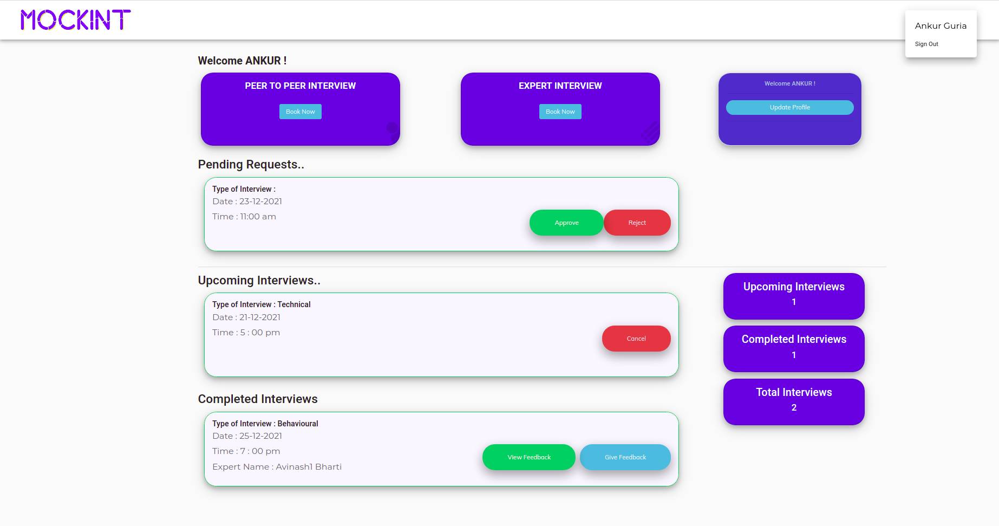
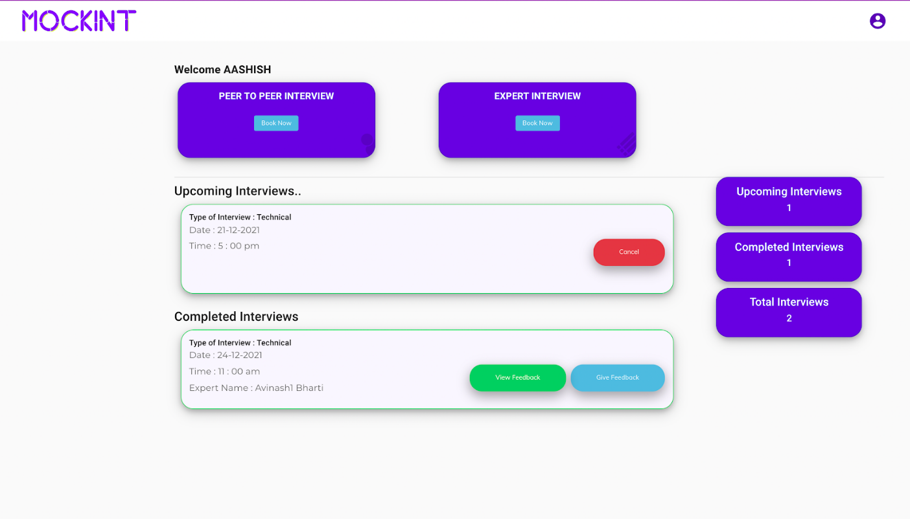
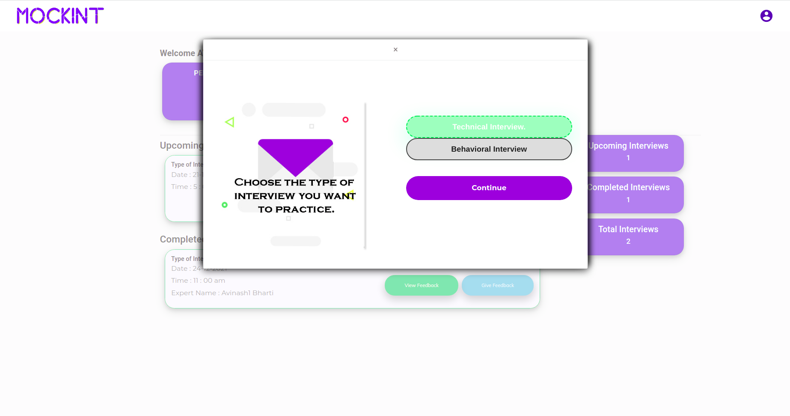
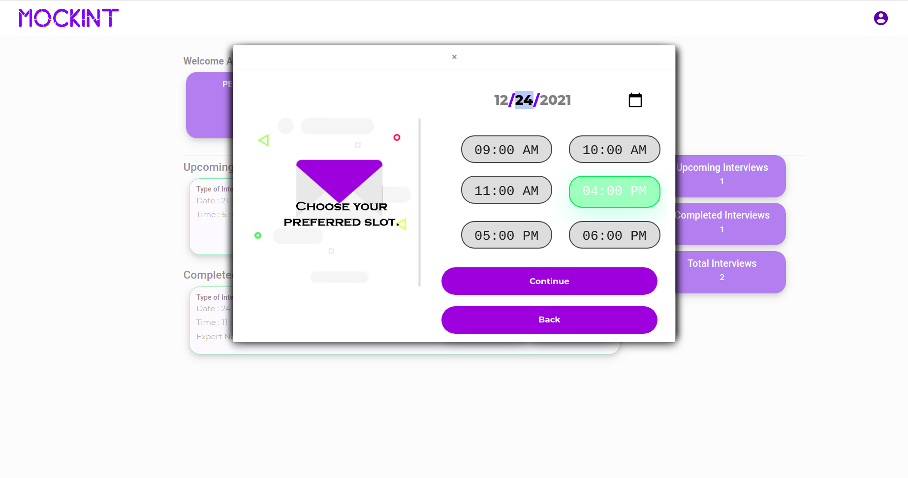
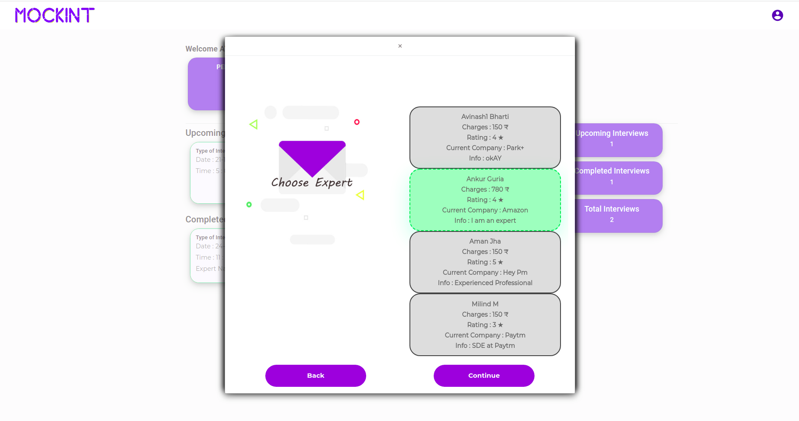
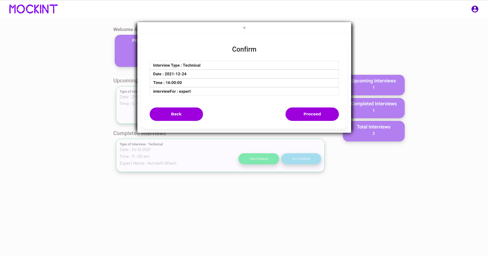
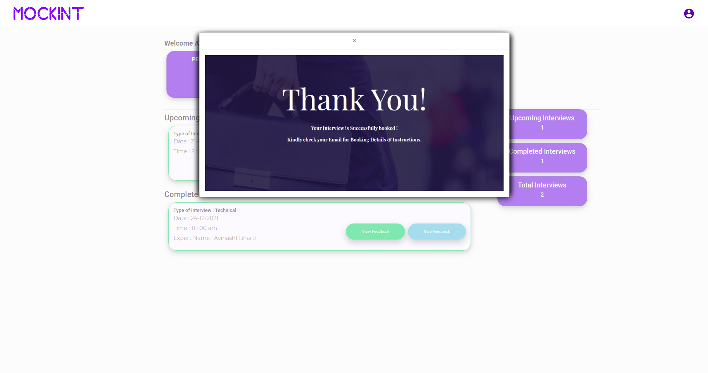

# MockInt-backend
The backend of a full-stack app to conduct mock interviews for job seekers, with peers or a certified expert in the field, built using ExpressJs, NodeJS, and PostgreSQL.

### [FRONTEND repository](https://github.com/ankurguria/MockInt-frontend)

#### User credentials (non-expert): rss@gmail.com; Password: nkjkn*(@#$dggkjn2!2@\*jkA
#### User credentials (expert): ankurguria232@gmail.com; Password: nkjkn*(@#$dggkjn2!2@\*jkA

- Landing Page

- User Dashboard (Expert)

- User Dashboard (Non-Expert)

- Flow of Interview Booking:

